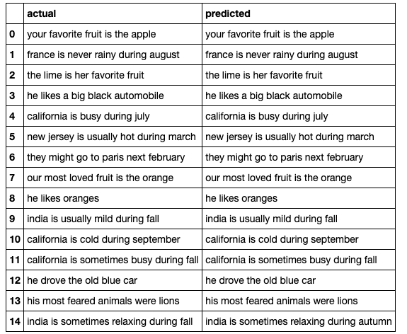
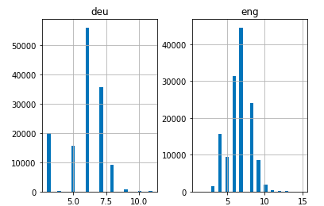
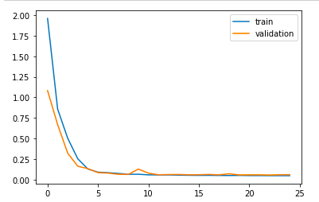
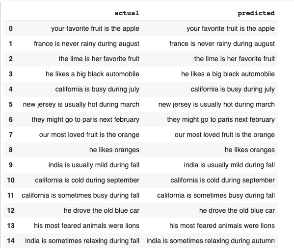

# French_to_English-machine-translation

## GOAL
The objective of this project is to convert a French sentence to its equivalent English part using a Neural Machine Translation (NMT) system.
## SOLUTION

1. READ DATA
• Our dataset is a csv file of French-English sentence pairs. First we will read the file.
• Now let's define a function to split the text into French-English pairs separated by '\n' and then split these pairs into English sentences and French sentences.
• The actual data contains over 1,35,000+ sentence-pairs. However, we will use
the first 50,000 sentence pairs only to reduce the training time of the model. You can change this number as per you system's computational power.

2. TEXT PRE-PROCESSING
• Text Cleaning
• Text to Sequence Conversion
To feed our data in a Seq2Seq model, we will have to convert both the input and the output sentences into integer sequences of fixed length. Before that, let's visualise the length of the sentences. We will capture the lengths of all the sentences in two separate lists for English and French, respectively.
• Let's vectorize our text data by using Keras's Tokenizer() class. It will
turn our sentences into sequences of integers. Then we will pad those
sequences with zeros to make all the sequences of same length.

3. MODEL BUILDING
• Now comes the exciting part! Let us define our Seq2Seq model architecture. We are using an Embedding layer and an LSTM layer as our encoder and another LSTM layer followed by a Dense layer as the decoder.
• We are using RMSprop optimizer in this model as it is usually a good choice for recurrent neural networks.
• Please note that we have used 'sparse_categorical_crossentropy' as the loss function because it allows us to use the target sequence as it is instead of one hot encoded format. One hot encoding the target sequences with such a huge vocabulary might consume our system's entire memory.
• It seems we are all set to start training our model. We will train it for 30 epochs and with a batch size of 512. You may change and play these hyperparameters.
• We will also be using ModelCheckpoint() to save the best model with lowest validation loss. I personally prefer this method over early stopping.

# DATASET

# TRAINING AND VALIDATION

# PREDICTIONS

